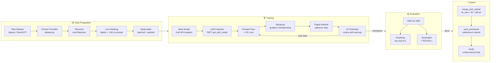
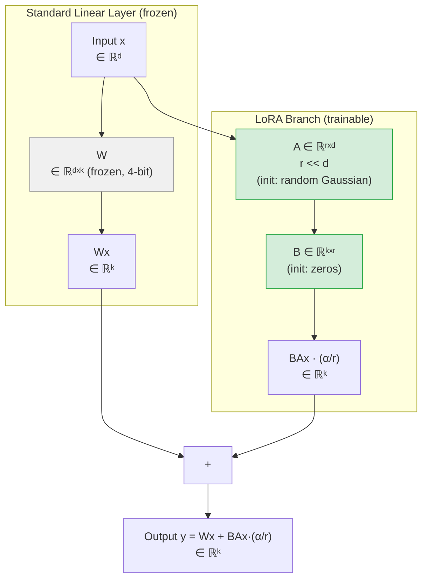
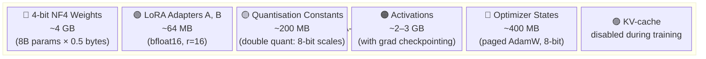
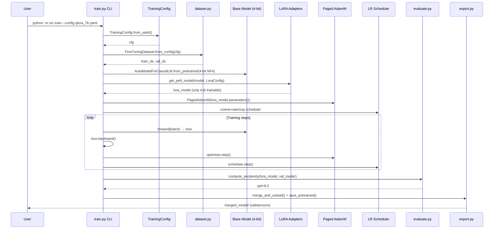

# Architecture — LLM Fine-tuning Pipeline

This document describes the system architecture for the `llm-finetuning` reference implementation.
All diagrams use [Mermaid](https://mermaid.js.org/) syntax (rendered on GitHub automatically).

---

## 1. Full Fine-tuning Pipeline



---

## 2. LoRA Mathematics

LoRA (**Lo**w-**R**ank **A**daptation) freezes the original weight matrix W and learns a
low-rank decomposition of the update ΔW.



**Key insight:** A ∈ ℝ^(r×d) and B ∈ ℝ^(k×r) together have only `r(d+k)` parameters
vs `dk` for the full weight matrix. With r=16, d=4096, k=4096: **131K vs 16.8M** params.

At initialisation B=0, so ΔW = BA = 0 and the adapter starts as an identity transform.

**Scaling:** The scaling factor α/r controls the effective learning rate of the adapter.
A larger α relative to r means the adapter updates are scaled up.

---

## 3. QLoRA Memory Breakdown

QLoRA combines 4-bit NF4 quantisation of the frozen base model with 16-bit LoRA adapters.



**Without QLoRA** (full bfloat16 fine-tuning):
- 8B × 2 bytes = **16 GB weights** + 16 GB gradients + 64 GB Adam states = **~96 GB**

**With QLoRA:**
- 8B × 0.5 bytes = **4 GB weights** (frozen, no gradients)
- Only LoRA params need gradients + optimizer states → **12 GB total**

---

## 4. Gradient Checkpointing — Memory / Compute Trade-off

```mermaid
graph TD
    subgraph "Standard Backprop  (more memory)"
        direction LR
        F1[Layer 1\nActivation ✓] --> F2[Layer 2\nActivation ✓]
        F2 --> F3[Layer 3\nActivation ✓]
        F3 --> F4[Layer N\nActivation ✓]
        F4 --> L1[Loss]
        L1 -->|"grad uses cached activations"| F3
        F3 -->|"grad uses cached activations"| F2
    end

    subgraph "Gradient Checkpointing  (less memory, +~33% compute)"
        direction LR
        G1[Layer 1\n✗ discarded] --> G2[Layer 2\n✗ discarded]
        G2 --> G3[Layer 3\n✗ discarded]
        G3 --> G4[Layer N\n✓ kept]
        G4 --> L2[Loss]
        L2 -->|"recompute fwd from checkpoint"| G3
        G3 -->|"recompute fwd from checkpoint"| G2
    end

    style F1 fill:#ffd,stroke:#cc0
    style F2 fill:#ffd,stroke:#cc0
    style F3 fill:#ffd,stroke:#cc0
    style F4 fill:#ffd,stroke:#cc0
    style G1 fill:#f0f0f0,stroke:#999
    style G2 fill:#f0f0f0,stroke:#999
    style G3 fill:#f0f0f0,stroke:#999
    style G4 fill:#ffd,stroke:#cc0
```



**Trade-off table:**

| Setting | Activation Memory | Compute Overhead | Typical Use |
|---------|------------------|------------------|-------------|
| No checkpointing | O(N) layers | None | Inference |
| Checkpoint every layer | O(1) | ~33% extra FLOPs | QLoRA training |
| Checkpoint every k layers | O(k) | ~1/k extra FLOPs | Full FT |

With gradient checkpointing:
- Activations are discarded after the forward pass
- During backprop, they are **recomputed** from the nearest checkpoint
- Net result: swap ~2 GB of activation memory for ~33% extra forward compute

In the QLoRA regime (frozen base, only adapter gradients), the activation overhead
is small since LoRA only modifies a few layers.

---

## 5. Component Interaction Diagram



---

## File Map

```
llm-finetuning/
├── src/
│   ├── dataset.py    ← prompt formatting, tokenisation, loss masking
│   ├── train.py      ← QLoRA training loop, config, optimiser
│   ├── evaluate.py   ← perplexity, ROUGE-L, generation
│   └── export.py     ← merge_and_unload, safetensors, manifest
├── configs/
│   ├── qlora_7b.yaml ← production 7-8B config
│   └── lora_1b.yaml  ← fast iteration / CI config
└── tests/            ← CPU-only pytest suite (no model downloads)
```
